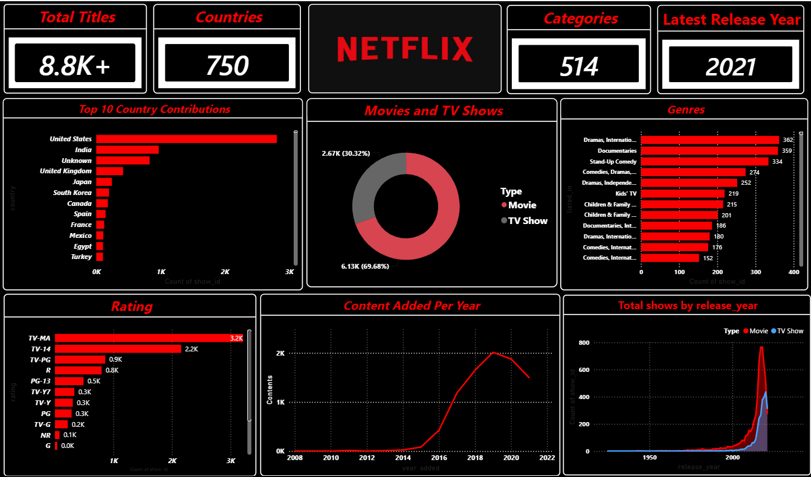

# Netflix-Data-Analysis
# 🎬 Netflix Data Analysis Dashboard

## Overview

This project analyzes the Netflix Movies and TV Shows dataset using Python and Power BI. The goal was to clean the raw data, find insight & patterns, and build an interactive dashboard that makes it easy to understand Netflix content library.

The project follows a complete data analysis workflow, starting with data cleaning in Python and ending with an interactive Power BI dashboard.

---

## Technologies Used

* Python
* Pandas
* NumPy
* Matplotlib
* Power BI Desktop
* Visual Studio Code
* Git & GitHub

---

## Project Workflow

* Imported and explored the dataset.
* Cleaned missing and inconsistent data using Pandas.
* Performed exploratory data analysis (EDA).
* Exported the cleaned dataset.
* Built an interactive Power BI dashboard with KPIs and visualizations.

---

## Dashboard Features

### KPI Cards

* Total Titles
* Categories
* Countries
* Latest release year

### Visualizations

* Movies vs TV Shows
* Content Added Over Time
* Top 10 Countries
* Rating Distribution
* Genre Analysis
* Release Year Trend

---

## Key Insights

* Movies make up a larger share of Netflix's catalog than TV Shows.
* The United States contributes the highest number of titles.
* TV-MA is one of the most common content ratings.
* Netflix's content library has grown significantly over the years.
* Drama and International Movies are among the most frequent genres.

---

## How to Run

1. Clone this repository.
2. Install the required Python libraries.
3. Run the Python scripts inside the `python` folder.
4. Open the Power BI dashboard (`.pbix`) file.
5. Explore the interactive dashboard.

---

## Dashboard Preview

---

## Author

**Sarthak Singh**

If you have any suggestions or feedback, I'd be happy to hear them. Every project is an opportunity to learn something new, and this taught me a lot about the complete data analysis process.
